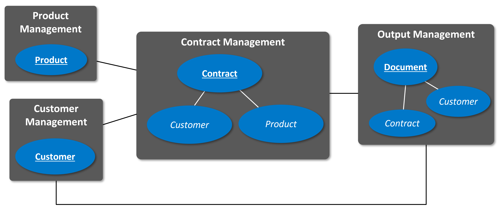
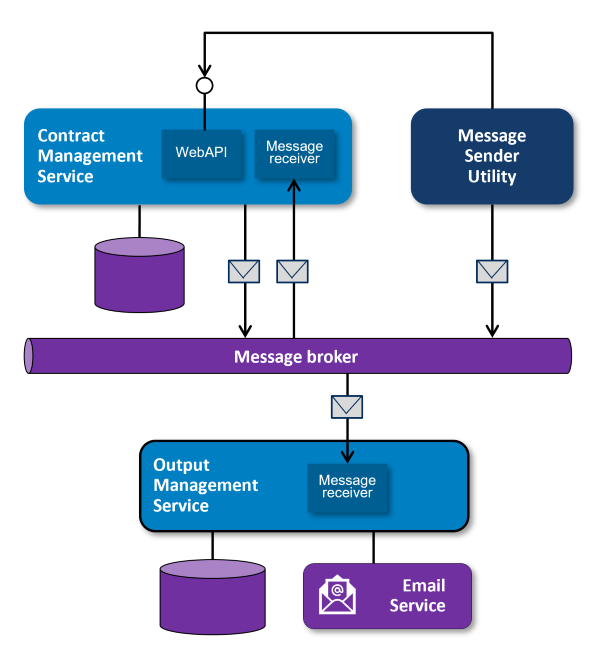
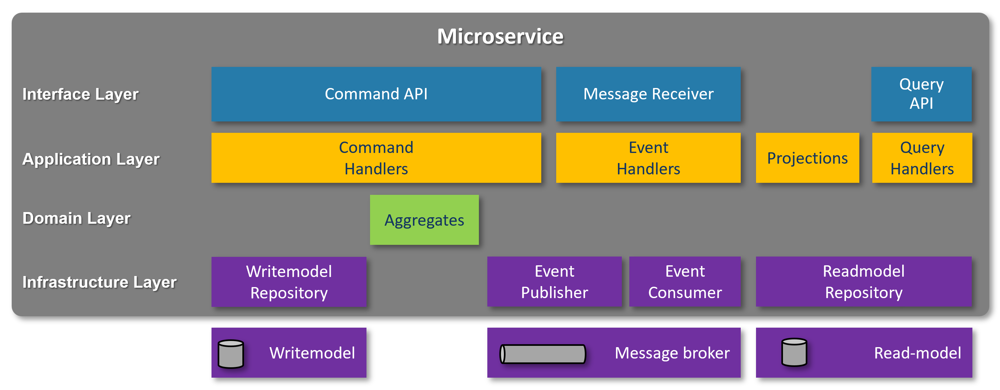
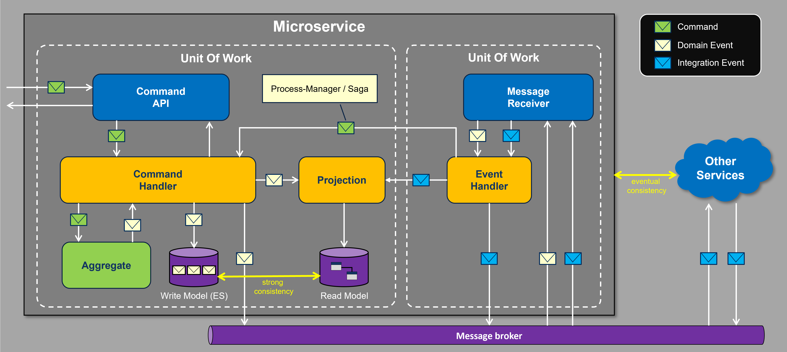

# Lessons learned building a cloud-native architecture in .NET

This repository contains samples (.NET / C#) that I use in my presentation *Lessons learned implementing CQRS, DDD and Event Sourcing in .NET*. 

The session will give an insight into the way .NET Core was used for implementing several cloud-native systems using DDD, the CQRS pattern and event-sourcing for storing state. It will cover the rationale behind the choices made and the lessons learned while designing and building this system. The session will cover both concepts as well as code.

## Sample Domain

The domain is inspired by actual projects I've participated in. The diagram below shows a bounded-context map of the sample application's domain:

The **product management** bounded-context (BC) contains functionality around the products that the organization offers. These are financial products loans). The **customer management** bounded-context (BC) contains functionality around the customers of the organization. 

In the sample application, both the product management and customer management BCs are not actually implemented. In stead, there is a utility named the **MessageSender** to simulate integration-events coming from these BCs (see [MessageSender utility](#message-sender-utility)).

The **output management** BC contains functionality for sending documents to customers. In the sample application, this BC's functionality is implemented in the [Output Management service](#output-mangement-service). The functionality is kept really simple for the sample application. It simulates sending contracts to the customer once the start-date of the contract has arrived. This behavior is triggered by the time-based event `DayHasPassed` (see [Message Sender utility](#message-sender-utility)).

The **contract management** BC contains functionality around the contracts the organization has with customers. This is the main focus of the sample and is (relatively) the most complex BC in the sample with several business-rules. That is why the [Contract Management service](#contract-management-service) that implements this BC's functionality is built using DDD, CQRS and Event-sourcing. 

A contract represents a product that is purchased by a customer. A contract has the following properties:

- **ContractNumber**: the unique identifier of the contract (format: CTR-yyyMMdd-9999).
- **CustomerNumber**: the identifier of the customer that purchased the product.
- **ProductNumber**: the identifier of the product that was purchased.
- **Amount**: the amount of the loan.
- **StartDate**: the start date of the contract.
- **Term**: the length of the contract (calculated from the start date).
- **PaymentPeriod**: the period between premium payments by the customer (Monthly, Quarterly, Yearly).

## Solution Architecture

The diagram below shows the logical solution architecture of the sample application:

## Generic Service Pattern

The Contract Management service is structured according to a generic pattern that I've defined. The pattern is supported by a modest set of convenience base-classes (not even big enough to call it a framework i.m.h.o.). These base-classes make sure that handling commands within the service is always done in a certain way. This also eliminates the need for the devs to write identical boiler-plate code over and over again. These base-classes are situated in the `Common` folder of the repo. 

The diagram below shows the high-level overview of the pattern:

You should be able to recognize the layers in the folder structure in the `ContractManagement` folder. 

## Command-handling flow

The `ContractManagement `service offers a command API that can be used to fire commands at it. This will trigger business-logic and change the state of a contract aggregate. The diagram below shows the flow that is followed when a command is fired at the service:

## DISCLAIMER

The code in this repository is only used for experimenting with the architectural concepts DDD, CQRS and Event Sourcing and for demos during the presentation. It is NOT production grade code, functionality is not complete (and may not even work correctly). Take this into account when just copying and pasting code from this repo into your own code-base (which is never a good idea by the way).

Because this is an experimental code, I will not accept issues or PRs on this repository.
